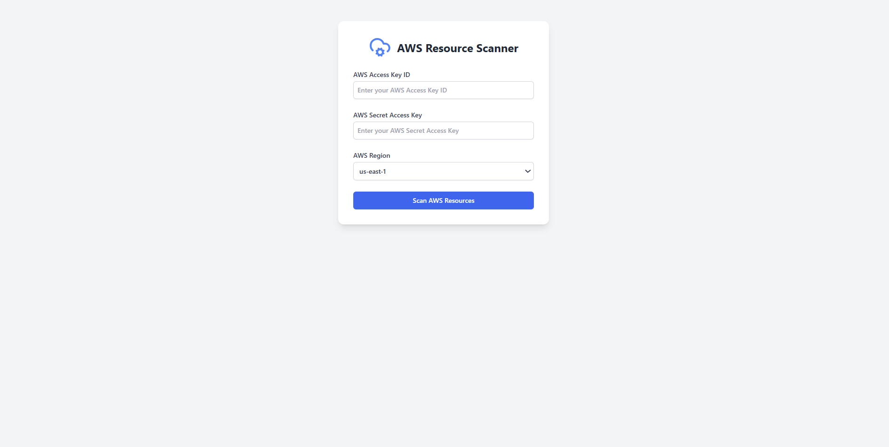

Here's a polished and enhanced version of your README.md file:

---

# AWS Scanner

Discover and scan AWS resources in your AWS account with ease!

## Getting Started

### Prerequisites

Before you begin, ensure you have the following installed:
- Node.js and npm

### Setting Up the Project

#### Backend Setup

1. **Navigate to the backend directory**:
   ```sh
   cd aws_scanner
   ```

2. **Start the frontend**:
   ```sh
   npm install && npm run dev # IF Linux
   npm install ; npm run dev # IF Windows
   ```

### Usage

- Access the application via your browser at `http://localhost:5173`
- Follow the prompts to scan your AWS resources.

### Demo



### Contributing

Feel free to fork this repository and submit pull requests. For major changes, please open an issue first to discuss what you would like to change.

### License

This project is licensed under the MIT License.

---

Does this look good to you? Let me know if you'd like any further tweaks!